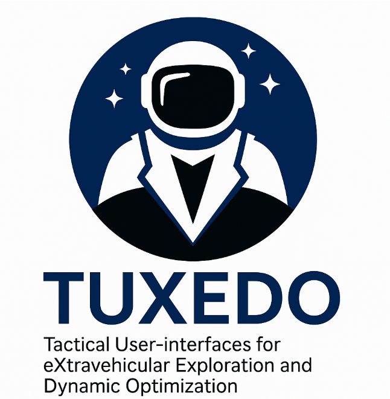

---

## 🧑‍🚀 Mission Overview
TUXEDO (Tactical User-interfaces for eXtravehicular Exploration and Dynamic Optimization) is developing next-generation **spacesuit and rover interfaces** that enhance astronaut autonomy through **AI-driven situational awareness, concise telemetry feedback, and adaptive navigation tools**.

---

## 🌕 NASA SUITS Challenge (FY25–26)
> NASA SUITS (Spacesuit User Interface Technologies for Students) challenges university teams to design AR/VR and UI systems that improve crew performance on lunar surface missions.

- **Sponsor:** NASA Johnson Space Center – EVA & Human Surface Mobility Program (EHP)
- **Test Week:** May 2026, Houston, TX
- **Scenario:** Locate and repair a lost Lunar Terrain Vehicle (LTV) during a nighttime EVA.
- **Deliverables:** Proposal → SDR → Test Week Demo → White Paper + Video (June 2026)

---

## 🧩 TUXEDO Architecture
- **AIA Service:** AI voice assistant w/ guardrails (concise numeric replies, step-by-step guidance)
- **EV UI:** Passthrough AR (HoloLens2) or tablet-based 2D/3D map, navigation, and caution/warning
- **PR UI:** Rover dashboard in DUST simulation with pathfinding, hazard avoidance, and resource tracking
- **TSS Client:** WebSocket JSON/GeoJSON telemetry interface to NASA’s Telemetry Stream Server

- `docs/` — proposal outline, mission requirements, HITL test plan, outreach plan, budget and schedule templates.
- `apps/ev-ui/` — Spacesuit display & voice UI app.
- `apps/pr-ui/` — Pressurized Rover UI for DUST sim control and map.
- `services/aia/` — AI microservice & guardrails.
- `libs/tss-client/` — TypeScript WebSocket client for TSS (JSON/GeoJSON).

## 📅 Key Milestones
| Phase | Deliverable | Date |
|-------|--------------|------|
| Letter of Intent | Email to nasa-suits@mail.nasa.gov | **Oct 2, 2025** |
| Proposal Submission | Via NASA STEM Gateway | **Oct 30, 2025** |
| Orientation | Virtual | **Dec 11, 2025** |
| Software Design Review (SDR) | Virtual | **Apr 2, 2026** |
| Onsite Testing (JSC Rock Yard) | Houston, TX | **May 2026** |
| White Paper + Video | Post-Test | **June 2026** |

---

## 🧠 AI & Safety Philosophy
- Use **Large Language Models** for natural-language interaction but apply **deterministic guardrails** for mission-critical data.
- Follow NASA guidance: AI must **reduce cognitive load** and **avoid hallucination** by confirming actions via telemetry.
- Voice output policy: **“Primary O2 47%, Secondary 99%”** instead of verbose phrasing.

---

## 🧪 HITL Testing Plan
Human-in-the-Loop trials to validate:
- Navigation accuracy & task efficiency
- Cognitive load reduction (NASA-TLX)
- Night/low-light visibility
- Network resilience (TSS packet loss)
- Safety protocols (abort, comms, lighting)

---

## 🤝 Community & Industry Engagement
- **Community (≥2):** K-12 “Hour of Code”, local STEM fairs, school demos
- **Industry (≥2):** XR vendors, robotics companies, AI researchers
- **Press/Social:** GitHub Pages, LinkedIn, X/Twitter, and university press releases

---

## 🏛️ Faculty Advisor & Endorsement
- Add signed institutional endorsement letter (PDF)  
- Add supervising faculty statement per NASA SUITS Section 7b :contentReference[oaicite:3]{index=3}

---

## 📜 License
MIT License — 2025 TUXEDO Team

